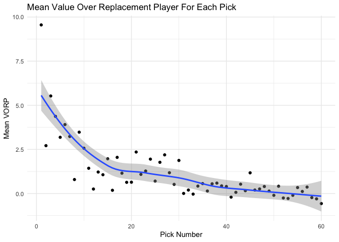
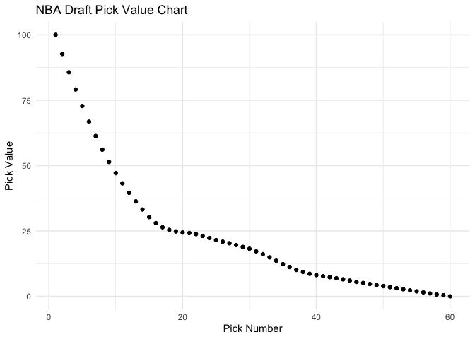

Creating a Draft Pick Value Chart
================
Tirdod Behbehani
July 5, 2021

## Project Description: Quantifying the Value of Each Pick in the NBA Draft

Looking at the drafts from 2001 through 2016, I used the Value Over
Replacement Player (VORP) metric to find the mean impact for each pick
in the draft. Unlike performance metrics such as RAPM and PIPM, VORP
reflects that players who don’t play at all aren’t helping their teams.
By using fifteen years of draft data, this provides 831 observations,
which provides me with enough of a sample size for each pick to perform
my analysis.

To grade each player, I took the sum of each player’s VORP for each
season they played under their rookie contract (four years for first
round picks and three years for second round picks). Using the sum, as
opposed to the average, puts greater weight on players that played
stayed in the league for more seasons than those who didn’t pan out.

To account for random variation, I smoothed the pick values.
Additionally, the pick values were normalized, setting the value of the
first pick to 100.

## Load Modules, Import Data, and Clean Data

``` r
suppressWarnings(suppressMessages(library(dplyr)))
suppressWarnings(suppressMessages(library(tidyverse)))
suppressWarnings(suppressMessages(library(knitr)))
suppressWarnings(suppressMessages(library(kableExtra)))

draft <- suppressMessages(read_csv('draftHistory.csv'))
vorp <- suppressMessages(read_csv('vorp.csv'))
```

Drop Unnecessary Columns in the Draft data frame.

``` r
drops <- c('numberRoundPick', 'typeOrganizationFrom', 
           'cityTeam', 'teamName', 'slugOrganizationTypeFrom', 
           'locationOrganizationFrom', 'nameTeam', 'slugTeam', 'typeOrganizationFrom',
           'idTeam', 'nameOrganizationFrom')

draft <- select(draft, -c(all_of(drops)))
```

Let’s show a brief snapshot of the two dataframes.

``` r
head(draft)
```

    ## # A tibble: 6 x 5
    ##   yearDraft numberPickOverall numberRound namePlayer     idPlayer
    ##       <dbl>             <dbl>       <dbl> <chr>             <dbl>
    ## 1      2016                 1           1 Ben Simmons     1627732
    ## 2      2016                 2           1 Brandon Ingram  1627742
    ## 3      2016                 3           1 Jaylen Brown    1627759
    ## 4      2016                 4           1 Dragan Bender   1627733
    ## 5      2016                 5           1 Kris Dunn       1627739
    ## 6      2016                 6           1 Buddy Hield     1627741

``` r
head(vorp)
```

    ## # A tibble: 6 x 7
    ##   Player              Pos     Age     G    MP  VORP Season
    ##   <chr>               <chr> <dbl> <dbl> <dbl> <dbl>  <dbl>
    ## 1 Tariq Abdul-Wahad   SG       27    24   441  -0.2   2002
    ## 2 Shareef Abdur-Rahim PF       25    77  2980   2.8   2002
    ## 3 Courtney Alexander  SG       24    56  1325  -0.1   2002
    ## 4 Victor Alexander    C        32    15    97  -0.2   2002
    ## 5 Malik Allen         PF       23    12   161   0     2002
    ## 6 Ray Allen*          SG       26    69  2525   4.4   2002

We’re only interested in a player’s first four seasons (at most), so we
can delete all seasons past a player’s fourth.

``` r
vorp$count <- with(vorp, ave(vorp$Player, vorp$Player, FUN = seq_along))

vorp$count <- as.numeric(vorp$count)

stats <- subset(vorp, vorp$count <= 4)
```

In examining the two datasets, I noticed that there was one discrepancy
between the two of them. The VORP dataset used apostrophes in names (ex.
De’Andre Hunter), whereas the draft dataset did not (ex. DeAndre
Hunter). With the sapply function, I made sure that the names in the two
datasets matched one another.

``` r
vorp$Player <-  sapply(vorp$Player, function(x) gsub("'", "", x))
```

Now, let’s join the VORP data with the draft history. We’ll temorarily
break the data into first and second round picks so we can remove the
fourth season for second round picks. Then we’ll put it back into one
dataframe.

``` r
firstRound <- subset(draft, numberRound %in% 1)
secondRound <- subset(draft, numberRound %in% 2)

draft <- subset(draft, select = -numberRound)

firstRoundStats <- inner_join(stats, firstRound, by = c("Player" = "namePlayer"))
secondRoundStats <- inner_join(stats, secondRound, by = c("Player" = "namePlayer"))

secondRoundStats <- subset(secondRoundStats, secondRoundStats$count <= 3)

stats <- as_tibble(rbind(firstRoundStats, secondRoundStats))
```

Now, we can get the Sum VORP for each player for the duration of their
rookie contract.

``` r
sumVORP <- stats %>% 
  group_by(Player) %>% 
  summarise(sumPlayerVORP = sum(VORP)) %>%
  mutate_if(is.numeric, round, 3)

draft <- inner_join(draft, sumVORP, by = c("namePlayer" = "Player"))
```

Now that we have the relevant data joined into one table, let’s look at
that table.

``` r
head(draft)
```

    ## # A tibble: 6 x 5
    ##   yearDraft numberPickOverall namePlayer     idPlayer sumPlayerVORP
    ##       <dbl>             <dbl> <chr>             <dbl>         <dbl>
    ## 1      2016                 1 Ben Simmons     1627732          12.6
    ## 2      2016                 2 Brandon Ingram  1627742           1.2
    ## 3      2016                 3 Jaylen Brown    1627759           1.6
    ## 4      2016                 4 Dragan Bender   1627733          -1.9
    ## 5      2016                 5 Kris Dunn       1627739           0.2
    ## 6      2016                 6 Buddy Hield     1627741           5.9

In looking at the data, Isaiah Thomas being an impactful NBA player
taken with the 60th pick is such an outlier that it skews the pick
valuations later on. Because of this, I will remove him from the dataset
to provide a more accurate reflection of the value of late second round
picks.

``` r
draft <- subset(draft, draft$namePlayer != 'Isaiah Thomas')
```

## Analysis

Now that we have the Summed VORP for each player, we can get the Mean
VORP for each pick.

``` r
pickScore <- draft %>% 
  group_by(numberPickOverall) %>% 
  summarise(meanPickVORP = mean(sumPlayerVORP)) %>%
  mutate_if(is.numeric, round, 3)

ggplot(pickScore, aes(numberPickOverall, meanPickVORP)) +
  geom_point() +
  theme_minimal() +
  labs(title = 'Mean Value Over Replacement Player For Each Pick', 
              x='Pick Number', y='Mean VORP') + geom_smooth()
```

    ## `geom_smooth()` using method = 'loess' and formula 'y ~ x'

<!-- -->

To account for outliers, I ran a Loess Regression to fit a curve through
the data points. It gives us the values from the blue curve in the above
graph.

``` r
lo <- loess(pickScore$meanPickVORP~pickScore$numberPickOverall)

pickScore <- pickScore[, -c(2)]
pickScore$pickValue <- lo$fitted
```

To make the pick values more practical and applicable for our purposes,
I normalized the values so that the first pick was worth 100 points.

``` r
normalize <- function(x) {
  return ((x - min(x)) / (max(x) - min(x)))
}

pickScore$pickValue <- normalize(pickScore$pickValue)
pickScore$pickValue <- round(pickScore$pickValue*100,1)
```

To see the calculated values of each pick, please see Table 1 below.

``` r
round1 <- pickScore[1:30,]
round2 <- pickScore[31:60,]

knitr::kable(list(round1, round2), 
             caption = "NBA Draft Pick Value Table",
             col.names = c("Pick Number", "Pick Value"),
             format = 'html', booktabs = TRUE) %>%
  kable_styling(bootstrap_options = 'striped', full_width = F, position="left")
```

<table class="kable_wrapper table table-striped" style="width: auto !important; ">
<caption>
NBA Draft Pick Value Table
</caption>
<tbody>
<tr>
<td>
<table>
<thead>
<tr>
<th style="text-align:right;">
Pick Number
</th>
<th style="text-align:right;">
Pick Value
</th>
</tr>
</thead>
<tbody>
<tr>
<td style="text-align:right;">
1
</td>
<td style="text-align:right;">
100.0
</td>
</tr>
<tr>
<td style="text-align:right;">
2
</td>
<td style="text-align:right;">
92.7
</td>
</tr>
<tr>
<td style="text-align:right;">
3
</td>
<td style="text-align:right;">
85.7
</td>
</tr>
<tr>
<td style="text-align:right;">
4
</td>
<td style="text-align:right;">
79.1
</td>
</tr>
<tr>
<td style="text-align:right;">
5
</td>
<td style="text-align:right;">
72.8
</td>
</tr>
<tr>
<td style="text-align:right;">
6
</td>
<td style="text-align:right;">
66.8
</td>
</tr>
<tr>
<td style="text-align:right;">
7
</td>
<td style="text-align:right;">
61.3
</td>
</tr>
<tr>
<td style="text-align:right;">
8
</td>
<td style="text-align:right;">
56.1
</td>
</tr>
<tr>
<td style="text-align:right;">
9
</td>
<td style="text-align:right;">
51.4
</td>
</tr>
<tr>
<td style="text-align:right;">
10
</td>
<td style="text-align:right;">
47.1
</td>
</tr>
<tr>
<td style="text-align:right;">
11
</td>
<td style="text-align:right;">
43.2
</td>
</tr>
<tr>
<td style="text-align:right;">
12
</td>
<td style="text-align:right;">
39.6
</td>
</tr>
<tr>
<td style="text-align:right;">
13
</td>
<td style="text-align:right;">
36.3
</td>
</tr>
<tr>
<td style="text-align:right;">
14
</td>
<td style="text-align:right;">
33.2
</td>
</tr>
<tr>
<td style="text-align:right;">
15
</td>
<td style="text-align:right;">
30.3
</td>
</tr>
<tr>
<td style="text-align:right;">
16
</td>
<td style="text-align:right;">
28.0
</td>
</tr>
<tr>
<td style="text-align:right;">
17
</td>
<td style="text-align:right;">
26.4
</td>
</tr>
<tr>
<td style="text-align:right;">
18
</td>
<td style="text-align:right;">
25.4
</td>
</tr>
<tr>
<td style="text-align:right;">
19
</td>
<td style="text-align:right;">
24.8
</td>
</tr>
<tr>
<td style="text-align:right;">
20
</td>
<td style="text-align:right;">
24.4
</td>
</tr>
<tr>
<td style="text-align:right;">
21
</td>
<td style="text-align:right;">
24.2
</td>
</tr>
<tr>
<td style="text-align:right;">
22
</td>
<td style="text-align:right;">
23.8
</td>
</tr>
<tr>
<td style="text-align:right;">
23
</td>
<td style="text-align:right;">
23.1
</td>
</tr>
<tr>
<td style="text-align:right;">
24
</td>
<td style="text-align:right;">
22.3
</td>
</tr>
<tr>
<td style="text-align:right;">
25
</td>
<td style="text-align:right;">
21.5
</td>
</tr>
<tr>
<td style="text-align:right;">
26
</td>
<td style="text-align:right;">
20.9
</td>
</tr>
<tr>
<td style="text-align:right;">
27
</td>
<td style="text-align:right;">
20.3
</td>
</tr>
<tr>
<td style="text-align:right;">
28
</td>
<td style="text-align:right;">
19.6
</td>
</tr>
<tr>
<td style="text-align:right;">
29
</td>
<td style="text-align:right;">
18.9
</td>
</tr>
<tr>
<td style="text-align:right;">
30
</td>
<td style="text-align:right;">
18.2
</td>
</tr>
</tbody>
</table>
</td>
<td>
<table>
<thead>
<tr>
<th style="text-align:right;">
Pick Number
</th>
<th style="text-align:right;">
Pick Value
</th>
</tr>
</thead>
<tbody>
<tr>
<td style="text-align:right;">
31
</td>
<td style="text-align:right;">
17.2
</td>
</tr>
<tr>
<td style="text-align:right;">
32
</td>
<td style="text-align:right;">
16.1
</td>
</tr>
<tr>
<td style="text-align:right;">
33
</td>
<td style="text-align:right;">
14.9
</td>
</tr>
<tr>
<td style="text-align:right;">
34
</td>
<td style="text-align:right;">
13.6
</td>
</tr>
<tr>
<td style="text-align:right;">
35
</td>
<td style="text-align:right;">
12.3
</td>
</tr>
<tr>
<td style="text-align:right;">
36
</td>
<td style="text-align:right;">
11.2
</td>
</tr>
<tr>
<td style="text-align:right;">
37
</td>
<td style="text-align:right;">
10.1
</td>
</tr>
<tr>
<td style="text-align:right;">
38
</td>
<td style="text-align:right;">
9.3
</td>
</tr>
<tr>
<td style="text-align:right;">
39
</td>
<td style="text-align:right;">
8.6
</td>
</tr>
<tr>
<td style="text-align:right;">
40
</td>
<td style="text-align:right;">
8.1
</td>
</tr>
<tr>
<td style="text-align:right;">
41
</td>
<td style="text-align:right;">
7.7
</td>
</tr>
<tr>
<td style="text-align:right;">
42
</td>
<td style="text-align:right;">
7.3
</td>
</tr>
<tr>
<td style="text-align:right;">
43
</td>
<td style="text-align:right;">
6.9
</td>
</tr>
<tr>
<td style="text-align:right;">
44
</td>
<td style="text-align:right;">
6.5
</td>
</tr>
<tr>
<td style="text-align:right;">
45
</td>
<td style="text-align:right;">
6.0
</td>
</tr>
<tr>
<td style="text-align:right;">
46
</td>
<td style="text-align:right;">
5.5
</td>
</tr>
<tr>
<td style="text-align:right;">
47
</td>
<td style="text-align:right;">
5.1
</td>
</tr>
<tr>
<td style="text-align:right;">
48
</td>
<td style="text-align:right;">
4.7
</td>
</tr>
<tr>
<td style="text-align:right;">
49
</td>
<td style="text-align:right;">
4.3
</td>
</tr>
<tr>
<td style="text-align:right;">
50
</td>
<td style="text-align:right;">
3.9
</td>
</tr>
<tr>
<td style="text-align:right;">
51
</td>
<td style="text-align:right;">
3.5
</td>
</tr>
<tr>
<td style="text-align:right;">
52
</td>
<td style="text-align:right;">
3.1
</td>
</tr>
<tr>
<td style="text-align:right;">
53
</td>
<td style="text-align:right;">
2.7
</td>
</tr>
<tr>
<td style="text-align:right;">
54
</td>
<td style="text-align:right;">
2.3
</td>
</tr>
<tr>
<td style="text-align:right;">
55
</td>
<td style="text-align:right;">
1.9
</td>
</tr>
<tr>
<td style="text-align:right;">
56
</td>
<td style="text-align:right;">
1.5
</td>
</tr>
<tr>
<td style="text-align:right;">
57
</td>
<td style="text-align:right;">
1.1
</td>
</tr>
<tr>
<td style="text-align:right;">
58
</td>
<td style="text-align:right;">
0.7
</td>
</tr>
<tr>
<td style="text-align:right;">
59
</td>
<td style="text-align:right;">
0.4
</td>
</tr>
<tr>
<td style="text-align:right;">
60
</td>
<td style="text-align:right;">
0.0
</td>
</tr>
</tbody>
</table>
</td>
</tr>
</tbody>
</table>

Below please find the final graph.

``` r
ggplot(pickScore, aes(numberPickOverall, pickValue)) +
       geom_point() +
       theme_minimal() +
       labs(title = 'NBA Draft Pick Value Chart', 
       x='Pick Number', y='Pick Value')
```

<!-- -->

The values in the above curve make intuitive sense, as we see a steep
dropoff in value throughout the lottery. The curve then steadily
declines through the rest of the draft, especially as the second round
wears on.

One thing that I find very interesting is the relatively smooth slope
observed from the 18th pick through the 22nd pick. This could be a
potential avenue for teams to exploit via the trade market in the
future.

## Conclusion

I think this research can be of major importance to NBA decision makers.
Having quantitative data on what each pick has historically produced
makes it easier to understand the draft. The values of each pick can be
used in trade negotiation talks to see if historical data indicates
whether a team should or shouldn’t make a deal. That being said,
understanding the general curve is more important than the exact values.

To use a real world example, let us look at the Orlando Magic, who have
the 5th and 8th pick in this year’s draft. The summed value of those two
picks is 128.9. There are rumors that they are interested in trading
those two picks for the second overall pick, which is worth 92.7 points.

From a pure pick value standpoint, the Magic would be very much
overpaying in this deal. However, with all of these potential trades, it
of course depends on the Magic’s valuation of who they would be taking
at 2 versus who they would be taking at 5 and 8. If we were to look at
the New York Knicks, who have the 19th and 21st picks in the draft, the
highest they could trade up and “win” the trade would be 10th.

## Future Research

One thing to consider for future research is to see how certain player
archetypes tend to perform based on where they were selected.
Additionally, the scope of this study would be greatly enhanced with a
better understanding of the value of future draft picks relative to
current draft picks. As many teams across the league look to stockpile
future draft capital, this would be extremely valuable information in
guiding each team’s strategy. This would require sound predictive
modelling of how good each team will be x years in advance.

Without knowing exact pick numbers years in advance, it might be
beneficial to look at pick ranges instead of pick numbers. Whereas teams
won’t know exactly where they will pick, they would likely have an
educated understanding of where they will be picking in future years,
especially for presumptive playoff teams. There are a lot of different
avenues that this research can take us with regards to deciding upon
optimal basketball strategy.
